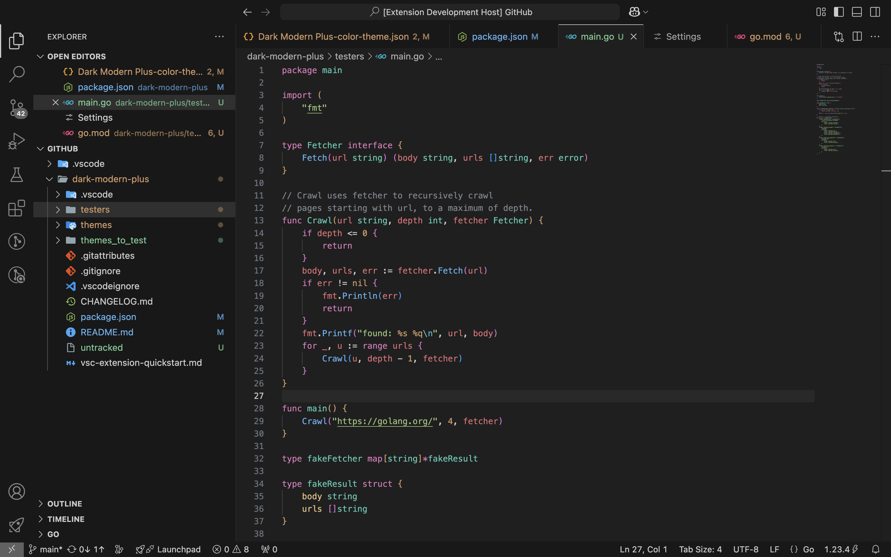

# Dark Modern Pro Theme

This is an improved version of `Default Dark Modern` theme.

Token colors were initially taken from `One Dark Pro Darker` theme, [its JSON on GitHub](https://github.com/Binaryify/OneDark-Pro/blob/master/themes/OneDark-Pro-darker.json)

Token colors are best configured for `Go`. Some small adjustments were made for `JS/TS` and `Python`, but they are not final.

If you want to contribute: [Theme's GitHub Repository](https://github.com/Le-BlitzZz/dark-modern-pro-color-theme)

